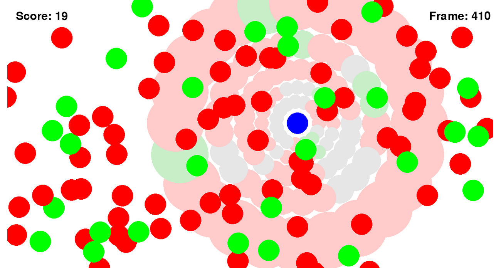

# Reinforcement Learning - Water World

## Table of Contents

- [Description](#description)
- [Team Members](#team-members)
- [Useful Links](#useful-links)

## Description

Water World is a game where all entities are molecules. 
The player must eat green molecules and avoid the red ones.

This project resembles a Deep Q Learning AI made in Python with TensorFlow 
that managed to learn how to play the game, knowing only the current score and
the state of his own vision sensors.

## Team Members

- Alexandru Știrbu (
    [LinkedIn](https://www.linkedin.com/in/alexandru-%C8%99tirbu-748068177/) | 
    [GitHub](https://github.com/Akrielz)
  )
- Robert Milea ( 
    [LinkedIn](https://www.linkedin.com/in/robert-milea-027a2420a/) | 
    [GitHub](https://github.com/DuArms/)
  )

## Useful links

More details about the project can be found at here:
https://docs.google.com/presentation/d/1LkE7lWsJO1ptGBuTjjbYhx1mSwZlhub2WxXqxeux_JI/edit#slide=id.p

Gameplay Demo:
https://www.youtube.com/watch?v=r-wKabSy0O0&feature=youtu.be
